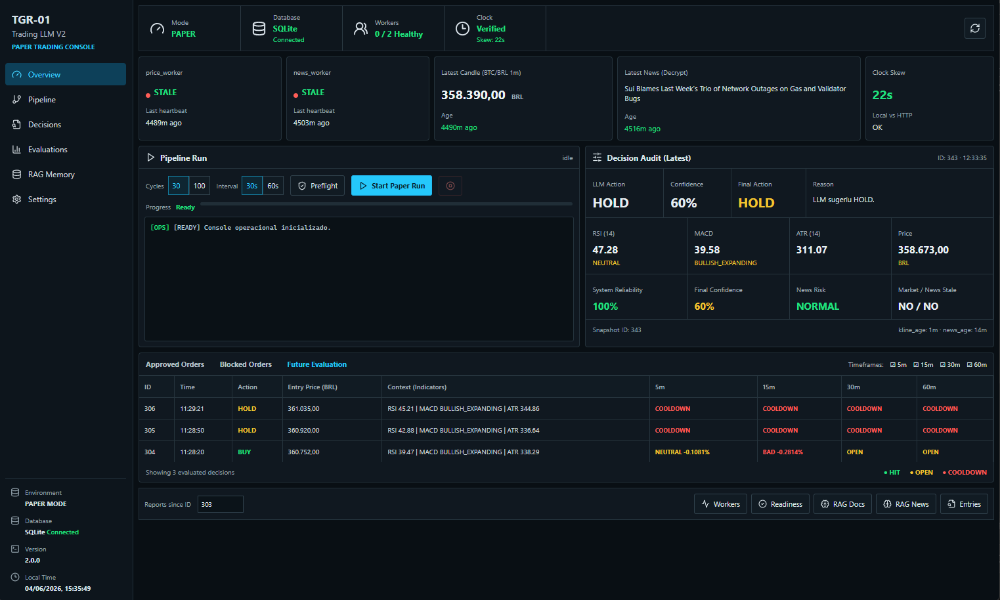
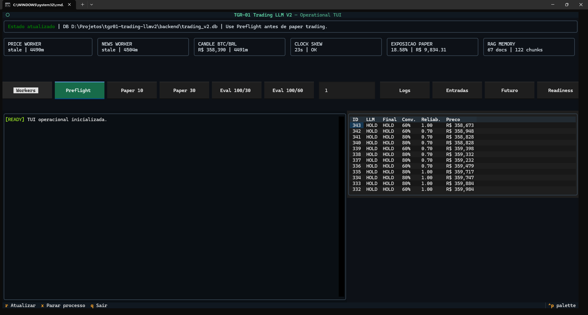

# TGR-01 Trading LLM V2

TGR-01 Trading LLM V2 is an experimental crypto trading research console. It
watches BTC/BRL market data, reads recent crypto news, asks an LLM for a
structured opinion, and then lets a deterministic Risk Manager decide whether
that opinion is safe enough to simulate in paper trading.

The project is built to answer one practical question:

> Can an LLM help review market context without being trusted blindly with
> money, math, or execution?

The answer in this repository is deliberately conservative. The LLM can only
suggest `BUY`, `SELL`, or `HOLD`. Python calculates the indicators, checks data
freshness, validates the response, applies the risk rules, simulates the paper
portfolio and records every decision for later review.

This is not an "AI magic trading bot". It is an auditable paper-trading lab
with safety rails, logs, reports, a terminal TUI and an Electron dashboard.

> Status: experimental paper trading. No real exchange write-access is enabled in this V2.

## What You Can See In This Repo

- a local paper-trading loop for BTC/BRL;
- a strict LLM decision contract;
- a deterministic Risk Manager that can override the LLM;
- worker health checks for price/news collectors;
- clock and stale-data checks before paper runs;
- SQLite decision logs with compact market snapshots;
- deterministic reports for approved, blocked and future-evaluated decisions;
- a terminal TUI for fast operation;
- an Electron dashboard for screenshots, monitoring and review;
- a local RAG/memory scaffold kept outside the order-approval path.

The intended workflow is research-first: run paper trading, inspect what the
LLM suggested, compare it with the Risk Manager decision, evaluate what the
market did afterward, and use those reports to improve the system.

## Core Principles

- LLM interprets context.
- Python calculates math.
- Risk Manager decides.
- Executor obeys.
- `HOLD` is the safe default.
- If data is stale, abort before the LLM.
- If data is insufficient, abort before the LLM.
- If the LLM fails validation, return `HOLD`.
- If the Risk Manager disagrees with the LLM, the Risk Manager wins.
- Every cycle is auditable through SQLite.

## Architecture

```text
Mercado Bitcoin read-only price data
              |
              v
       price_worker.py
              |
              v
          SQLite
              ^
              |
       news_worker.py
              ^
              |
        RSS news feeds

          SQLite
              |
              v
    payload_builder.py
              |
              v
  Python indicators/statuses
    RSI / MACD / ATR / data health / news risk
              |
              v
      Decision Agent LLM
       strict JSON output
              |
              v
       Pydantic validation
              |
              v
       Risk Manager gates
              |
              v
       Paper executor
              |
              v
        trade_logs audit
```

## Interfaces

TGR-01 has two operator-facing interfaces over the same Python pipeline. Both
are paper-trading oriented and both keep execution behind the deterministic
preflight and Risk Manager layers.

### Electron Ops Console



The Electron console is the visual operations dashboard. It shows worker
health, latest candle/news age, clock skew, paper exposure, latest decision
audit, future-move evaluation and allowlisted pipeline actions.

### Terminal TUI



The Textual TUI is the fast terminal workflow. It is useful for quick checks,
worker/preflight control, paper runs, logs, entry reports and deterministic
evaluations without leaving the command line.

## Current Stack

- Python
- SQLite
- Pandas
- Pydantic
- OpenAI-compatible API client
- Groq
- Optional OpenRouter/DeepSeek experiments
- Textual TUI
- React + Vite + Electron operations console
- Mercado Bitcoin read-only data
- RSS news ingestion
- Windows `.bat` operational scripts

## Repository Layout

```text
backend/
  agents/
    contracts.py              # Pydantic decision schema
    decision_agent.py         # LLM Decision Agent
  core/
    audit.py                  # compact payload snapshots for each decision
    clock_sync.py             # HTTP clock-skew verification
    database.py               # SQLite path, schema, diagnostics
  data/
    price_worker.py           # Mercado Bitcoin price ingestion
    news_worker.py            # RSS news ingestion
  execution/
    market_data_gateway.py    # market data helper layer
  features/
    indicators.py             # RSI/MACD/ATR and technical states
    payload_builder.py        # LLM-ready payload
  risk/
    risk_manager.py           # deterministic gates, cooldown, Kelly
  ops/
    commands.py               # allowlisted operational commands
    run_action.py             # safe shared runner for TUI and Electron
    run_experiment.py         # isolated long-run paper experiments
  rag/
    rag_store.py              # safe local retrieval memory scaffold
  tests/
    run_paper_trading.py      # paper trading runner
    run_20_cycles.py          # temp-DB smoke run
    analyze_trade_logs.py     # SQLite audit summary
    evaluate_decisions.py     # future-move evaluation
    llm_review_decisions.py   # LLM review of deterministic reports
    compare_llm_models.py     # A/B model comparison
    preflight_data_date.py    # strict data freshness preflight
    analyze_entry_decisions.py# approved/blocked entry report
    dashboard_state.py        # SQLite-derived JSON for the ops console
    clean_mock_news.py        # controlled mock-news cleaner
    seed_historical_data.py   # manual historical bootstrap
    test_*.py                 # pytest safety tests
  main.py                     # orchestrator cycle
  requirements.txt

run_tgr01.bat                 # launches the Python operational TUI
run_tgr01_tui.bat             # direct TUI launcher
run_tgr01_legacy.bat          # fallback batch menu
run_100_eval.bat              # 100-cycle experiment + reports
run_pipeline_debug.bat        # debug helper
desktop/                      # Electron operational console

*.md                          # architecture, plan, study and review docs
```

## Desktop Ops Console

The optional Electron interface is a thin operational panel over the Python
CLI. It does not duplicate trading rules or bypass Risk Manager gates.

```powershell
cd .\desktop
npm install
npm run dev
```

The console exposes strict preflight, paper runs, clean SQLite audit views,
entry-specific reports and future-movement evaluation. The dashboard also
shows worker health, candle/news age, clock skew and paper exposure.

Electron actions go through an explicit allowlist in `backend/ops/commands.py`.
The interface cannot execute arbitrary shell commands, skip strict preflight,
or enable real exchange orders.

## Main Pipeline

1. `price_worker.py` collects BTC/BRL market data from Mercado Bitcoin.
2. `news_worker.py` collects crypto headlines from RSS sources.
3. SQLite stores candles, news, worker heartbeats, paper portfolio, and trade logs.
4. `payload_builder.py` builds a compact market context.
5. `indicators.py` computes RSI, MACD, ATR and qualitative technical states.
6. `decision_agent.py` asks the LLM for strict JSON: `BUY`, `SELL`, or `HOLD`, plus a short human-readable evidence brief.
7. Pydantic validates the LLM response.
8. `risk_manager.py` applies deterministic gates, confidence, cooldown and Kelly sizing.
9. Paper execution simulates portfolio changes.
10. The cycle is written to `trade_logs`.

## Python Operational TUI

The default Windows launcher opens a Textual terminal interface:

```powershell
.\run_tgr01.bat
```

The TUI keeps the operator workflow inside one terminal: worker health, clock
skew, paper exposure, recent decisions, streamed subprocess output, preflight,
paper runs and deterministic reports. The original batch menu remains
available through `run_tgr01_legacy.bat`.

Long experiments can also run without a UI:

```powershell
python .\backend\ops\run_experiment.py --cycles 100 --sleep 60
```

This orchestrator performs strict preflight first, records the initial
`trade_logs.id`, runs paper trading and generates deterministic reports. LLM
review remains an auxiliary optional step.

## Safety Model

The pipeline is intentionally conservative.

### Pre-LLM Safety

The orchestrator aborts before calling the LLM when:

- candles are missing;
- candles are insufficient;
- the latest candle is stale;
- the latest candle is not from the current local day;
- required workers are dead in strict preflight.

### LLM Contract Safety

The Decision Agent must return strict JSON validated by Pydantic.

The LLM may only suggest:

- `BUY`
- `SELL`
- `HOLD`

Alongside the short machine-friendly `reasoning`, the LLM also returns a
`decision_brief`: up to three compact lines explaining why it chose the action,
which technical data it used, and which news/data-health/exposure context
influenced the decision. This is stored in `trade_logs` for human review.

The LLM does not calculate:

- RSI;
- MACD;
- ATR;
- Kelly;
- position size;
- final executable order.

### Risk Manager Safety

The Risk Manager blocks orders when deterministic context disagrees with the LLM.

Examples:

- `BUY` blocked when market data is stale.
- `BUY` blocked when news is stale.
- `BUY` blocked when negative news red flags exist.
- `BUY` blocked when RSI is `OVERBOUGHT`.
- `BUY` blocked when MACD is `BEARISH_EXPANDING` or `BEARISH_DIVERGENCE`.
- `SELL` blocked when RSI is `OVERSOLD`.
- `SELL` blocked when MACD is `BULLISH_EXPANDING` or `BULLISH_DIVERGENCE`.
- repeated `BUY`/`SELL` blocked by cooldown.

`HOLD` is always allowed.

## Decision Agent Prompt Hardening

A real issue found during testing was that the model could treat `RSI OVERSOLD` as a strong `BUY` signal even while MACD was bearish.

The prompt now explicitly states:

```text
RSI OVERSOLD sozinho NAO autoriza BUY.
Se MACD estiver BEARISH_EXPANDING ou BEARISH_DIVERGENCE, prefira HOLD.
```

After this change, recent paper cycles showed the LLM returning `HOLD` for:

- `RSI OVERSOLD + MACD BEARISH_EXPANDING`
- `RSI OVERSOLD + MACD NEUTRAL`

## Data Health

The payload includes a `data_health` section:

- latest kline timestamp;
- kline age in seconds;
- market data stale flag;
- latest news timestamp;
- news age in seconds;
- news stale flag.

This prevents "world frozen" behavior where workers silently die and the bot keeps trading on old data.

## News Risk

The system currently uses a simple deterministic red-flag detector for news terms such as:

- hack;
- crash;
- ban;
- panic;
- liquidation;
- regulator;
- suspension;
- prohibition.

This is intentionally simple. RAG/vector search is not required for the current version.

## RAG Memory

RAG is an optional memory layer for research and review. It is not an
order-approval engine.

The current safe RAG workflow can:

- ingest project notes and recent news;
- store past `trade_logs` as retrievable decision cases;
- retrieve similar context for human or LLM review after a paper run.

```powershell
python .\backend\tests\ingest_rag_sources.py --project-docs --news-hours 24 --news-limit 20
python .\backend\tests\ingest_decision_cases.py --since-id 300 --limit 100
python .\backend\tests\query_decision_memory.py --trade-log-id 382 --limit 5
python .\backend\tests\query_decision_memory.py --current-payload --limit 5
```

The retrieved context is push-only: Python selects it and prints it for review.
It does not let the LLM query arbitrary memory, and it does not bypass the
fresh market payload or the deterministic Risk Manager.

## Paper Trading

Paper trading uses a simulated portfolio stored in SQLite.

The executor records:

- LLM action;
- LLM reasoning;
- LLM decision brief;
- final action;
- final Risk Manager reasoning;
- conviction;
- system reliability;
- final confidence;
- executed size;
- reference execution price;
- effective paper execution price after slippage;
- fee paid in BRL;
- gross and net notional;
- BRL/BTC balance deltas;
- paper equity before and after execution;
- realized PnL on sells;
- average BTC cost basis.

No real order is sent to any exchange.

## Evaluation and Reports

The project includes deterministic evaluation tooling.

### Trade Log Analysis

```powershell
python .\backend\tests\analyze_trade_logs.py --limit 40
```

Summarizes:

- final actions;
- LLM action vs final action;
- common reasoning;
- approved orders;
- virtual portfolio;
- paper equity.

### Future-Move Evaluation

```powershell
python .\backend\tests\evaluate_decisions.py --since-id 123 --horizons 5,15,30,60
```

Classifies decisions by future price movement:

- `good`
- `bad`
- `neutral`
- `missed_upside`
- `avoided_downside`
- `not_matured`

This is not treated as absolute truth. It is a review tool.

### LLM Review of Deterministic Report

```powershell
python .\backend\tests\llm_review_decisions.py --input .\backend\reports\last_100_decision_evaluation.json --output .\backend\reports\last_100_llm_review.md
```

The LLM reviewer does not recalculate indicators or prices. It critiques the deterministic report.

### Model Comparison

```powershell
python .\backend\tests\compare_llm_models.py --models groq:llama-3.3-70b-versatile groq:openai/gpt-oss-120b --prompt-mode hardened
```

Tests models on:

- current real payload;
- synthetic `RSI OVERSOLD + MACD BEARISH_EXPANDING`;
- synthetic `RSI OVERSOLD + MACD BULLISH_EXPANDING`.

No trade is executed.

## Setup

### 1. Create a Virtual Environment

```powershell
cd D:\Projetos\tgr01-trading-llmv2
python -m venv .venv
.\.venv\Scripts\Activate.ps1
pip install -r .\backend\requirements.txt
```

### 2. Configure Environment

Copy the example env file:

```powershell
Copy-Item .\backend\.env.example .\backend\.env
```

Fill the required keys in `backend/.env`.

Do not commit `backend/.env`.

### 3. Initialize SQLite

```powershell
python .\backend\core\database.py
```

### 4. Start Workers

Use the Windows menu:

```powershell
.\run_tgr01.bat
```

Option `2` starts the real workers.

Or run manually:

```powershell
python .\backend\data\price_worker.py
python .\backend\data\news_worker.py --mode real
```

### 5. Run Strict Preflight

```powershell
python .\backend\tests\preflight_data_date.py --require-workers
```

Only continue when the latest candle is from the current day and fresh.

### 6. Run Paper Trading

Short run:

```powershell
python .\backend\tests\run_paper_trading.py --cycles 10 --sleep 30
```

Longer experiment:

```powershell
.\run_100_eval.bat
```

## Windows Operational Menu

`run_tgr01.bat` opens the Textual TUI. The original batch menu remains
available through `run_tgr01_legacy.bat`:

1. SQLite diagnostics
2. Start real workers in background
3. Data preflight for test
4. Short paper trading test
5. Strict preflight for real pipeline
6. Longer paper trading run
7. Analyze trade logs
8. Operational readiness report
9. Future-move decision evaluation
10. LLM review
11. Process inspection

## Testing

Run:

```powershell
python -m compileall .\backend
python -m pytest .\backend\tests -q
```

The test suite covers:

- indicator safety;
- insufficient data behavior;
- malicious/invalid LLM JSON;
- risk gates;
- stale data behavior;
- pipeline smoke scenarios.

## Runtime Files Not Committed

The following are intentionally ignored:

- `backend/.env`
- `backend/trading_v2.db`
- `backend/backups/`
- `backend/logs/`
- `backend/reports/`
- `__pycache__/`
- `.pytest_cache/`

This keeps secrets, market data, logs and local runtime state out of Git.

## Current Phase

The project is currently in:

```text
Paper trading hardening + model behavior evaluation
```

Completed:

- SQLite-centered pipeline;
- real data ingestion;
- strict preflight;
- deterministic indicators;
- strict LLM JSON contract;
- Risk Manager directional gates;
- cooldown;
- paper trading;
- trade log analysis;
- deterministic report generation;
- LLM report review;
- model comparison tooling;
- prompt hardening against RSI-only BUY;
- three-line LLM decision briefs stored in audit logs;
- compact payload snapshots in `trade_logs`;
- snapshot-aware audit reports;
- HTTP clock-skew verification;
- allowlisted operational runner shared by TUI and Electron;
- Textual terminal interface;
- Electron operational console;
- lexical RAG memory scaffold kept outside the order-approval path;
- fee/slippage-aware paper execution;
- average-cost position tracking;
- realized PnL and immediate equity delta reporting.

Not completed:

- real trading;
- vector embeddings and semantic retrieval;
- multi-agent production loop;
- tax-aware reporting;
- real exchange execution;
- historical backtesting;
- multi-timeframe strategy.

## Roadmap

### Next Steps

- Add explicit ATR status.
- Add volume status.
- Improve BUY-approved/BLOCKED reports.
- Add semantic embeddings behind the safe RAG boundary.
- Run more 100-cycle experiments with `since-id` isolation.

### Later

- Multi-timeframe 5m/15m context.
- Market regime detection.
- Historical backtesting.
- Walk-forward testing.
- RAG for review/memory, not for order approval.
- Semi-auto mode with human review.
- Real execution only with strict limits and manual confirmation.

## RAG and Vector Database

The project includes a local lexical RAG scaffold. It is intentionally not
part of the current trading critical path. Future semantic embeddings must
remain behind the same safety boundary.

Planned safe use:

- previous trade memory;
- historical event retrieval;
- notes from study material;
- review of past mistakes;
- report comparison.

RAG will not:

- calculate indicators;
- decide order size;
- override the Risk Manager;
- send trades.

## Disclaimer

This project is experimental engineering work for research and paper trading. It is not financial advice. It should not be used for real trading without additional safeguards, fee/slippage modeling, exchange execution hardening, operational monitoring, and explicit manual approval.
