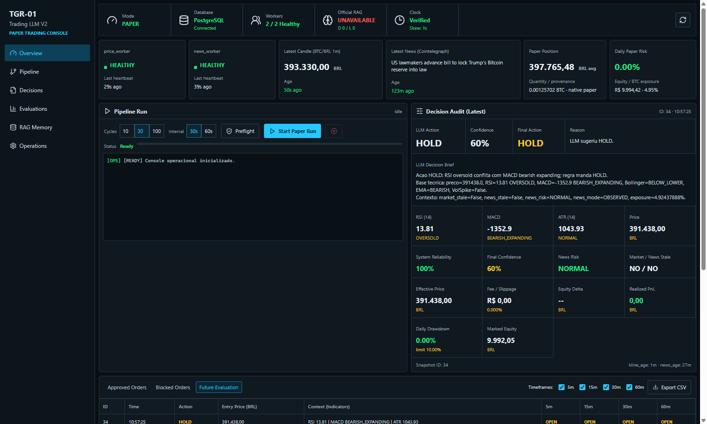
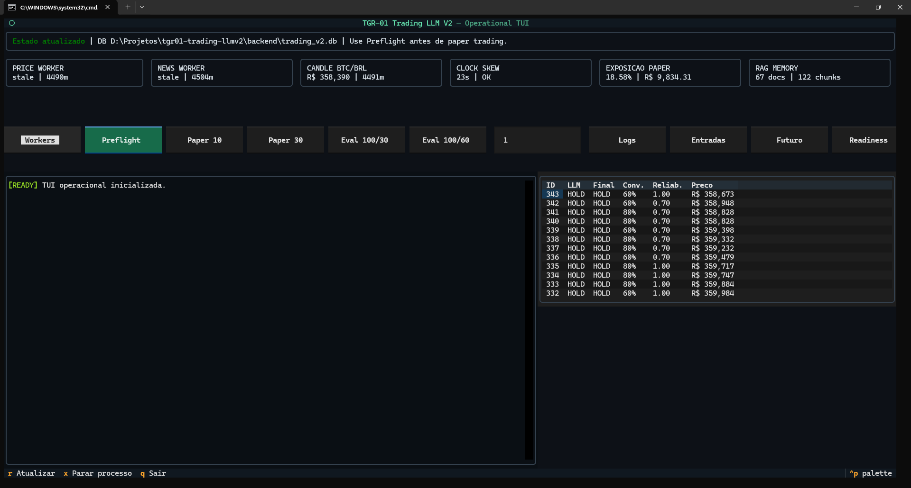

# TGR-01 Trading LLM V2

TGR-01 is an experimental BTC/BRL paper-trading laboratory. It combines live
market data, recent crypto news, technical indicators, an LLM decision agent,
and a deterministic Risk Manager in one auditable pipeline.

The central question is deliberately narrow:

> Can an LLM help interpret market context without being trusted with the
> calculations, risk limits, or final execution decision?

The LLM may suggest `BUY`, `SELL`, or `HOLD` and explain the evidence it used.
Python computes the indicators, validates data freshness, checks capital and
position invariants, applies deterministic risk gates, simulates the portfolio,
and records the complete decision trail in PostgreSQL.

This is not a promise of profit and is not a live trading product. The current
version is research-only and has no real exchange write path.

The paper/research scope has a documented [final acceptance](FINAL_ACCEPTANCE.md)
with reproducible evidence, safety properties, and known limitations.

The latest [operational red-team report](RED_TEAM_REPORT_2026-08-01.md) covers
the Electron/TUI command surface, prompt-injection defenses, process handling,
dependency auditing, external RAG health, and a seven-scenario LLM safety
matrix. It recorded `109` passing Python tests, `6` passing Node tests, zero npm
vulnerabilities, and `7/7` LLM safety checks. Directional quality was `6/7`:
the remaining review case is an overly conservative `HOLD` in a clean bearish
scenario.

The [deterministic tool protocol report](LLM_TOOL_RED_TEAM_REPORT_2026-08-01.md)
adds bounded LLM-requested analysis tools, objective market-event memory, and
historical model/prompt benchmarks. The expanded suite records `141` passing
Python tests. The global history and causal-ML pipeline expands that coverage to `158`
passing Python tests. This layer remains opt-in and paper-only.

## Interfaces

Both interfaces operate the same allowlisted Python pipeline. Neither interface
can bypass strict preflight or the Risk Manager.

### Electron Operations Console



The desktop console shows worker health, database and RAG status, latest market
data, paper exposure, the latest decision audit, approved/blocked entries, and
future-movement evaluations.

### Terminal TUI



The Textual TUI provides the same operational workflow in a terminal, including
workers, strict preflight, paper runs, reports, internal memory ingestion, and
diagnostic access to the external hybrid RAG.

## What The System Does

1. `price_worker.py` collects read-only BTC/BRL candles from Mercado Bitcoin.
2. `news_worker.py` collects and normalizes crypto news from RSS sources.
3. PostgreSQL stores market data, news, health, paper capital, decisions, and
   retrieval audit records.
4. Python computes RSI, MACD, ATR, freshness, news risk, and exposure.
5. Optionally, the LLM selects up to three allowlisted analysis contracts;
   Python executes the read-only calculations and returns their results.
6. The Decision Agent returns a Pydantic-validated action and a short evidence
   brief.
7. The deterministic Risk Manager can block the suggestion or reduce its
   reliability.
8. The paper executor applies fees/slippage and updates the simulated position
   transactionally.
9. Reports compare suggestions, final decisions, entries, and later market
   movement without claiming an absolute "accuracy" score.

## Safety Model

The project follows these boundaries:

- **LLM interprets context.** It does not calculate RSI, MACD, ATR, Kelly, or
  position size.
- **Python calculates and validates.** Missing or invalid capital state fails
  loudly instead of inventing a fallback balance.
- **Risk Manager has final authority.** It can block an LLM action; the LLM
  cannot override a deterministic gate.
- **Paper executor only.** No real order endpoint is implemented or enabled.
- **`HOLD` is the safe default.** Technical/API/schema failures cannot become an
  order.
- **Freshness is mandatory.** Stale candles abort before the LLM. News freshness
  is represented explicitly and affects reliability/rules.
- **Runs are auditable.** The market snapshot, LLM brief, risk verdict, sizing,
  fees, slippage, balance deltas, and PnL state are persisted.
- **RAG is untrusted evidence.** Retrieved text never enters the deterministic
  order-approval path and cannot approve, block, or size a trade.

Examples of deterministic gates include stale market data, incompatible RSI and
MACD direction, negative-news red flags, exposure limits, cooldown, insufficient
balance, and inconsistent position state.

## Architecture

```text
Mercado Bitcoin (read-only)       RSS news feeds
             |                         |
             v                         v
      price_worker.py            news_worker.py
             |                         |
             +-----------+-------------+
                         v
                    PostgreSQL
                         |
                         v
                payload_builder.py
                         |
            RSI / MACD / ATR / health
                         |
              optional bounded tool plan
             trend / Donchian / drawdown / volume
                         |
                         v
                 Decision Agent LLM
             strict Pydantic contract
                         |
                         v
              deterministic Risk Manager
                         |
                         v
                paper_simulator.py
                         |
             audit logs and evaluation

Optional review-only path:
project corpus -> external hybrid RAG -> untrusted evidence -> operator/reviewer
```

## Decision Contract

The Decision Agent must return a validated structure containing:

- action: `BUY`, `SELL`, or `HOLD`;
- conviction;
- compact reasoning;
- `decision_brief`, limited to a few lines explaining which technical,
  news-health, and portfolio facts influenced the suggestion.

The brief exists to make later review possible. It is evidence about why the
model responded, not permission to execute.

Prompt profiles can be compared on real and historical scenarios. The balanced
profile treats stale news as uncertainty rather than automatically confusing it
with stale market prices, while the Risk Manager remains independently
authoritative.

### Deterministic analysis tools

The optional tool protocol exposes four fixed calculations:

- multi-timeframe trend alignment;
- Donchian range breakout;
- drawdown and downside semideviation;
- volume/OBV confirmation.

The model selects a Pydantic contract, not an executable function body. The
application enforces fixed windows, a three-call limit, a 1,500-candle limit,
`as_of_timestamp`, strict extra-field rejection, compact results, and
best-effort audit persistence. Failures return `ERROR` or
`INSUFFICIENT_DATA`; they never become directional evidence. Objective
drawdowns of at least 3% can be deduplicated as structured market events, but
the model cannot write arbitrary memories.

The production path remains disabled by default. To exercise it in paper mode:

```powershell
$env:LLM_TOOLS_ENABLED="true"
python .\backend\tests\run_paper_trading.py --cycles 10 --sleep 30
```

The code default is `openai/gpt-oss-120b`; `LLM_MODEL` can override it. Groq
has announced the hosted Llama 3.3 70B shutdown for August 16, 2026, so it is
kept only as a historical benchmark rather than the default.

## Data And Persistence

The active application is PostgreSQL-only. A legacy SQLite database can be
imported once with the migration utility, but active modules and tests are
prevented from silently falling back to SQLite.

Important stored entities include:

- one-minute BTC/BRL candles;
- normalized news and source timestamps;
- worker heartbeats;
- virtual BRL/BTC balances;
- paper position/cost-basis state;
- complete trade logs and compact market snapshots;
- internal RAG documents/chunks/retrieval logs.
- deterministic analysis-tool audits and objective market events.

Pytest creates and destroys a separate database whose name must end in `_test`.
The test harness refuses to point at the application database.

## RAG Layers

TGR-01 supports two memory layers, both outside the trade-approval path.

### Internal Memory

The PostgreSQL-backed internal memory stores curated project documents, recent
news, and past decision cases for deterministic inspection.

```powershell
python .\backend\tests\ingest_rag_sources.py --project-docs --news-hours 24 --news-limit 20
python .\backend\tests\ingest_decision_cases.py --since-id 300 --limit 100
python .\backend\tests\query_decision_memory.py --current-payload --limit 5
```

### External Hybrid RAG

An optional Docker-based retrieval service can index this repository using:

- local `qwen3-embedding:0.6b` embeddings through Ollama;
- PostgreSQL + pgvector;
- C++ exact/HNSW dense retrieval;
- Java Lucene/BM25 lexical retrieval;
- reciprocal-rank fusion in Python;
- `Qwen/Qwen3-Reranker-0.6B` on CUDA.

The trading client fixes the corpus filter, bounds query/result sizes, rejects
foreign-corpus results, security-flagged chunks, and prompt-injection phrases
detected locally in retrieved text. It labels every accepted chunk as untrusted,
records retrieval metadata, and fails open when the service is down.
"Fail open" here means trading analysis continues without RAG evidence; it does
not mean an order bypasses risk checks.

The override in `docker-compose.rag.override.yml` avoids a PostgreSQL port
collision by publishing the RAG database on host port `5433` and mounts this
repository read-only for ingestion. The external RAG is a separate project and
is not required to run TGR-01.

Diagnostic query:

```powershell
python .\backend\tests\query_external_rag.py --health
python .\backend\tests\query_external_rag.py "where does RiskManager reject stale market data"
```

The final validated local deployment indexed 800 chunks in both dense and lexical
indexes, used the CUDA reranker, recovered after a simulated lexical-index
failure, and continued to reject hostile retrieved instructions without placing
the RAG in any trade-approval module.

Maintenance calls such as `/ingest`, `/embed`, and index rebuilds must be
serialized. A concurrent `/embed` red-team run left the external orchestrator
handlers pending and required an orchestrator-only restart; paper balances and
trade logs remained unchanged because this integration is observational and
fail-open. The trading health check also requires dense/lexical count parity,
not merely two non-empty indexes.

## Reports And Evaluation

The reporting layer intentionally separates facts from interpretation.

```powershell
python .\backend\tests\analyze_trade_logs.py --since-id 303 --limit 50
python .\backend\tests\analyze_entry_decisions.py --since-id 303
python .\backend\tests\evaluate_decisions.py --since-id 303 --horizons 5,15,30,60
python .\backend\tests\trading_readiness_report.py
```

Reports cover:

- LLM suggestion versus final Risk Manager action;
- approved and blocked entries;
- data-health and news-risk snapshots;
- paper balances, exposure, fees, slippage, and cost basis;
- future movement at multiple horizons;
- outcomes such as `good`, `bad`, `neutral`, `missed_upside`,
  `avoided_downside`, and `not_matured`.

Those labels are review aids, not an absolute truth metric. A second LLM may
critique the deterministic report, but it does not rewrite prices or indicators.

## Historical Scenario Testing

Historical tooling can download/seed candles, locate representative market
windows, and replay the LLM against uptrend, downtrend, and sideways regimes.

```powershell
python .\backend\tests\seed_historical_data.py --from-local "2026-06-06 00:00" --to-local "2026-06-07 23:59"
python .\backend\tests\find_market_windows.py --from-local "2026-06-06 00:00" --to-local "2026-06-07 23:59"
python .\backend\tests\run_historical_llm_scenarios.py --name uptrend --from-local "2026-06-06 01:40" --to-local "2026-06-06 02:40" --cycles 10 --step-seconds 180
```

Historical replay is for decision analysis. It does not alter the live paper
portfolio.

Model and prompt comparison with the same deterministic evidence:

```powershell
python .\backend\tests\benchmark_tool_augmented_llm.py --cycles 3 `
  --models groq:openai/gpt-oss-120b groq:qwen/qwen3.6-27b `
  --profiles evidence_balanced trend_following
```

The research basis and exact safety boundaries are documented in
[btc_trading_tools_research.md](btc_trading_tools_research.md).

## Causal ML Dataset And Baselines

The repository can now build an offline machine-learning dataset without
letting feature rows see future candles. It computes causal price, trend,
volatility, volume, channel, and drawdown features, then creates exact 15/60
minute future labels after an estimated round-trip cost and minimum edge.

Short missing-candle intervals are represented explicitly with zero-volume
synthetic candles for indicator continuity. Large gaps start new segments.
Decision rows and future labels still require observed exchange candles, and
every row records its observed-data coverage.

```powershell
py -3.11 .\backend\tests\build_ml_dataset.py
py -3.11 .\backend\tests\evaluate_ml_baselines.py
```

Mercado Bitcoin exposes candles as JSON rather than CSV. The bulk downloader
discovers the first one-minute candle actually retained by the API, downloads
the complete range in rate-limited seven-day chunks, validates every response,
resumes valid chunks after interruption, and performs a streaming CSV merge:

```powershell
py -3.11 .\backend\tests\download_mb_history.py

py -3.11 .\backend\tests\build_ml_dataset.py `
  --chunks-dir .\backend\data_exports\mercado_bitcoin_btc_brl_1m\chunks
```

Raw exports and generated datasets stay under ignored runtime directories and
are never committed. The current API retains BTC/BRL one-minute candles from
2023-03-31 onward even though daily candles exist from 2013.

For global regime pretraining, the repository also consumes Binance's official
monthly BTCUSDT archive. Every ZIP is matched against its published SHA-256
checksum, bounded against decompression abuse, converted to the canonical CSV
contract, and kept separate from the Mercado Bitcoin calibration domain:

```powershell
py -3.11 .\backend\tests\download_binance_history.py

py -3.11 .\backend\tests\build_multidomain_ml_dataset.py
```

The verified local snapshot contains `4,656,799` BTCUSDT candles from August
2017 through June 2026 and produces `4,648,648` causal examples. Historical
archive anomalies realigned `21,602` candles within a strict 30-second source
offset tolerance; the affected month, archive digest, count, and maximum shift
are persisted in per-month metadata. Global BTCUSDT is for pretraining only.
BTC/BRL remains a separate fine-tuning and execution-calibration dataset.

The neural research environment uses the official `torch 2.12.1+cu130` wheel.
CUDA execution was verified on the local RTX 3060 with a real tensor operation;
model checkpoints must record the exact Torch, CUDA, feature-schema, dataset,
and split versions before they can be compared.

The evaluator uses chronological train/validation/test partitions and purges
the tail of earlier partitions so labels cannot cross a split boundary. It also
prevents overlapping fixed-horizon trades from being counted as independent
profits. Four deterministic references are reported: always-HOLD, 60-minute
momentum, EMA/MACD confirmation, and RSI mean reversion.

The complete local download produced `1,342,682` raw candles and `819,594`
eligible causal rows (`145,527 BUY`, `531,577 HOLD`, `142,490 SELL`). This is
enough to begin compact learned-model experiments, but it is not evidence of a
tradable edge. On the untouched chronological test partition, every current
action-taking deterministic baseline lost approximately all simulated capital
after repeated round-trip costs; always-HOLD preserved capital. A learned model
must therefore predict return distributions and uncertainty, abstain often,
and pass persistence, cooldown, cost, and deterministic risk gates before an
action is simulated. See
[ml_dataset_and_training_plan.md](ml_dataset_and_training_plan.md).

## Reproducing The Latest Red Team

```powershell
py -3.11 -m pytest -q -W error::pytest.PytestUnraisableExceptionWarning
py -3.11 .\backend\tests\chaos_monkey.py
py -3.11 .\backend\tests\redteam_llm_matrix.py
py -3.11 .\backend\tests\query_external_rag.py --health

Set-Location .\desktop
npm test
npm audit
npm run test:electron
```

The Electron smoke test opens the compiled application rather than a browser
preview. It validates navigation, all 17 allowlisted operations, report tabs,
timeframe controls, IPC execution, renderer errors, and horizontal overflow.

## Setup

### 1. Install Python Dependencies

```powershell
python -m venv .venv
.\.venv\Scripts\Activate.ps1
pip install -r .\backend\requirements.txt
```

### 2. Configure Environment

```powershell
Copy-Item .\.env.example .\.env
Copy-Item .\backend\.env.example .\backend\.env
```

The root `.env` contains PostgreSQL and test-database settings used by Docker
Compose. `backend/.env` contains LLM and optional external-RAG settings. Set a
strong local PostgreSQL password, keep both database URLs consistent with it,
and add only the LLM keys you need. Never commit either real `.env` file.

### 3. Start PostgreSQL

```powershell
docker compose up -d db
python .\backend\core\database.py
```

To import a legacy local SQLite database once:

```powershell
python .\backend\tests\migrate_sqlite_to_postgres.py --source .\backend\trading_v2.db --replace
```

The migrator reads the source and validates exact destination counts. Back up
both databases before replacing existing PostgreSQL data.

### 4. Start Workers And Preflight

Use the TUI:

```powershell
.\run_tgr01.bat
```

Or run directly:

```powershell
python .\backend\tests\start_workers.py
python .\backend\tests\preflight_data_date.py --require-news-today --require-workers --require-clock-sync
```

Only continue when candles, news requirements, workers, and clock pass.

### 5. Run Paper Trading

```powershell
python .\backend\tests\run_paper_trading.py --cycles 10 --sleep 30
python .\backend\ops\run_experiment.py --cycles 100 --sleep 60
```

The runner creates a PostgreSQL custom-format backup before a paper session.

### 6. Reconcile Legacy Paper Cost Basis

Older paper balances may contain BTC created before average-cost tracking was
introduced. The executor now blocks a new order when BTC exists without a
matching `paper_position_state`; it never guesses a historical cost from the
current price.

Inspect the state without changing anything:

```powershell
python .\backend\ops\reconcile_paper_position.py
```

The preferred path deterministically replays legacy approved orders and refuses
to persist unless the reconstructed BRL and BTC balances match the observed
portfolio within a strict tolerance:

```powershell
python .\backend\ops\reconcile_paper_position.py --from-legacy-logs
python .\backend\ops\reconcile_paper_position.py --from-legacy-logs --confirm
```

Every successful reconciliation is written to
`paper_position_reconciliations` with its method, source log IDs, reconstructed
balances, observed balances, and replay details. Manual cost or a deliberate
mark-to-market baseline remain exceptional operator-reviewed alternatives:

```powershell
python .\backend\ops\reconcile_paper_position.py --avg-cost-brl 350000
python .\backend\ops\reconcile_paper_position.py --mark-to-market
```

Only an explicit second run with `--confirm` persists the position state. The
tool updates cost-basis metadata, not BRL/BTC balances.

### 7. Run Tests

```powershell
python -m pytest -q
```

The suite covers indicator edge cases, stale/missing data, contract failures,
capital invariants, transaction rollback, concurrent access, database isolation,
RAG boundaries, prompt-injection filtering, and operational command allowlists.
The final validation for this revision completed 158 Python tests, 6 Node tests,
and the Vite production build successfully.

## Desktop Console

```powershell
cd .\desktop
npm install
npm run dev
```

In development, Vite serves the UI and Electron opens it as a desktop window.
For a production frontend build:

```powershell
npm run build
```

Electron actions map to explicit command IDs in `backend/ops/commands.py`; user
input cannot become an arbitrary shell command.

## Repository Layout

```text
backend/
  agents/       LLM contracts and decision agent
  core/         PostgreSQL schema, engine, repositories, clock checks
  data/         price and news workers
  execution/    paper portfolio execution
  features/     indicators, payloads, dashboards
  ml/           causal datasets, baselines, and training-readiness gates
  ops/          allowlisted TUI/Electron operations
  rag/          internal memory and external fail-open client
  risk/         deterministic Risk Manager
  tests/        tests, reports, historical and operational tools
desktop/        React, Vite and Electron operations console
docs/assets/    interface screenshots
```

## Current Scope

Implemented:

- read-only live market/news ingestion;
- PostgreSQL persistence and isolated test database;
- strict LLM contracts and evidence briefs;
- deterministic risk gates and paper execution accounting;
- TUI and Electron operations surfaces;
- deterministic and LLM-assisted review reports;
- historical regime replay;
- causal ML datasets, purged temporal splits, and deterministic baselines;
- internal retrieval memory;
- optional external hybrid RAG diagnostics;
- defensive and adversarial tests.

Before any consideration of real-money operation, the system would still need
substantially more out-of-sample testing, calibrated fees/slippage, broader
market regimes, exchange-specific order constraints, monitoring, incident
procedures, credential isolation, manual kill switches, and independent review.

## License

No open-source license has been granted yet. Copyright remains with the
repository owner. Add an explicit license before inviting reuse or distribution.

## Disclaimer

This repository is educational and experimental software, not financial advice.
Crypto markets are risky. Paper results do not predict real execution or future
performance.
